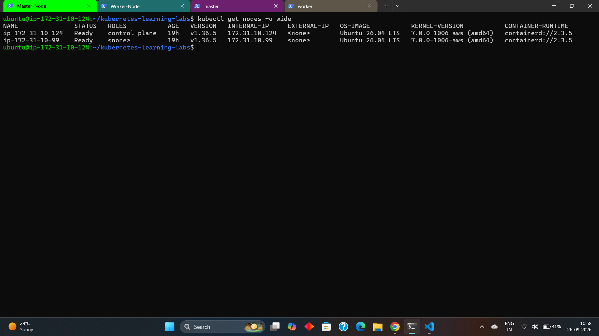
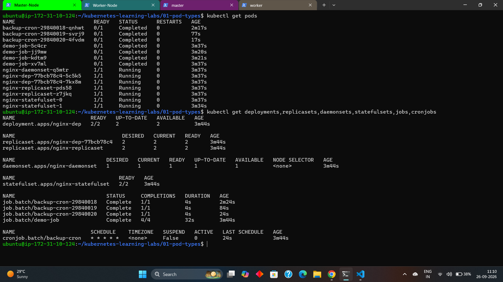
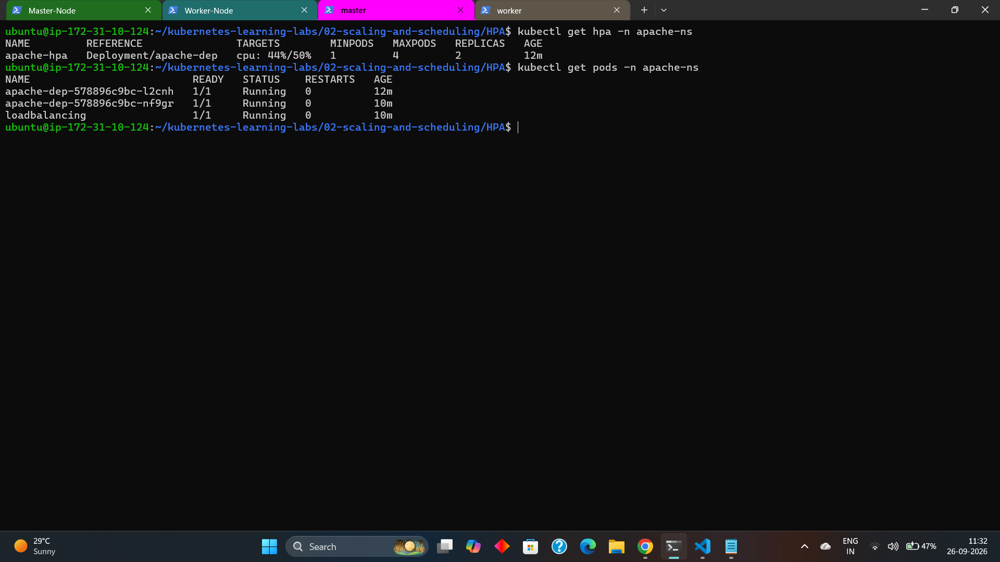
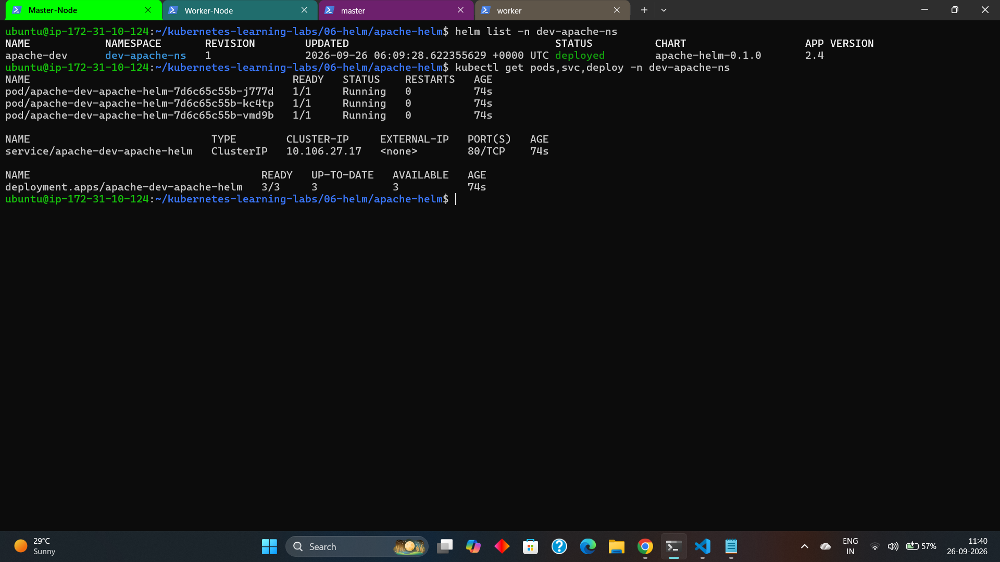
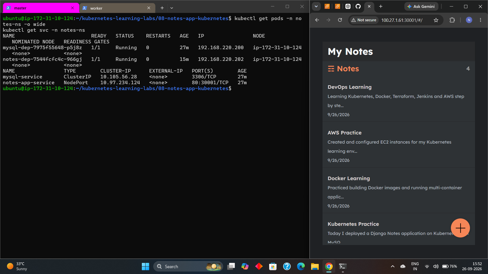

# Kubernetes Learning Labs

Hands-on Kubernetes practice covering workloads, scheduling, storage, RBAC, CRDs, Helm, probes, autoscaling, and application deployment.

This repository contains Kubernetes manifests and notes from my hands-on learning and practice.

## What I Practiced

- Pods and workload controllers
- Deployments, ReplicaSets, DaemonSets, StatefulSets, Jobs and CronJobs
- HPA and VPA
- Node affinity
- Taints and tolerations
- Resource requests, limits and quotas
- Liveness, readiness and startup probes
- PersistentVolumes and PersistentVolumeClaims
- ConfigMaps
- Stateful workloads
- RBAC with Roles, RoleBindings and ServiceAccounts
- Custom Resource Definitions (CRDs)
- Helm charts and Helm templating
- Kubernetes Dashboard access
- Application deployment using Kubernetes Services

## Repository Structure

| Directory | Topics |
|---|---|
| `01-pod-types/` | Deployment, ReplicaSet, DaemonSet, StatefulSet, Job, CronJob |
| `02-scaling-and-scheduling/` | HPA, VPA, probes, node affinity, taints/tolerations, resources |
| `03-storage/` | PV, PVC, ConfigMap, StatefulSet, MySQL storage examples |
| `04-rbac/` | ServiceAccount, Role, RoleBinding and RBAC authorization |
| `05-custom-resource-definitions/` | CustomResourceDefinition and Custom Resource |
| `06-helm/` | Apache Helm chart, templates, Service, Ingress, HPA and Helm test |
| `07-kubernetes-dashboard/` | Dashboard access and RBAC example |
| `08-notes-app-kubernetes/` | Django Notes App, MySQL, Secrets, Services and Kubernetes deployment |

## Helm

The Apache chart demonstrates:

- `Chart.yaml`
- `values.yaml`
- Deployment template
- Service template
- ServiceAccount
- Ingress
- HTTPRoute
- HPA
- Helm test
- Reusable helper templates

Validate the chart with:

```bash
helm lint 06-helm/apache-helm
helm template demo 06-helm/apache-helm
```

## Notes Application

The `08-notes-app-kubernetes/` lab demonstrates deploying a Django Notes application with MySQL on Kubernetes using:

- Namespace
- Django Deployment
- MySQL Deployment
- Kubernetes Secret
- ClusterIP Service
- NodePort Service
- Node selector and tolerations
- Readiness probes
- Resource requests and limits
- Automatic Django database migrations

The Django application listens on port `8000`, while the Kubernetes Service exposes it through NodePort `30001`.

The Django application connects to MySQL through the Kubernetes Service:

```text
mysql-service:3306
```

The application used in this lab is based on the public
[djang-notes-app](https://github.com/LondheShubham153/django-notes-app) project by LondheShubham153. The focus of this lab is containerization and Kubernetes deployment rather than original application development.

> Note: MySQL uses ephemeral container storage in this lab. Persistent storage can be added later using a PersistentVolume and PersistentVolumeClaim.

## Screenshots

### Kubernetes Cluster


### Kubernetes Workloads


### HPA


### Helm


### Notes Application


## Useful Commands

```bash
kubectl get nodes
kubectl get pods -A
kubectl get deployments -A
kubectl get services -A

kubectl apply -f <manifest>.yml
kubectl get -f <manifest>.yml
kubectl delete -f <manifest>.yml

kubectl describe pod <pod-name>
kubectl logs <pod-name>

helm lint 06-helm/apache-helm
helm template demo 06-helm/apache-helm
helm install demo 06-helm/apache-helm
helm test demo
helm uninstall demo
```

## Validation

For regular Kubernetes manifests:

```bash
kubectl apply --dry-run=client -f <manifest>.yml
```

For Helm:

```bash
helm lint 06-helm/apache-helm
helm template demo 06-helm/apache-helm
```

Helm files under `06-helm/apache-helm/templates/` are templates and should be validated through Helm rather than as standalone YAML.

## Security

Never commit:

- AWS credentials
- kubeconfig files
- private keys
- `.pem` files
- `.env` files
- real passwords or tokens

The MySQL Secret in `03-storage/mysql-secret-example.yml` contains only the dummy value `change-me` for learning purposes. It is not a real credential.

Never replace the example value with a real password before committing the repository.

## Learning Goal

The goal of this repository is to demonstrate practical Kubernetes learning through focused labs, manifests, and a small application deployment rather than a collection of copied notes.

